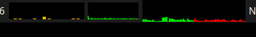
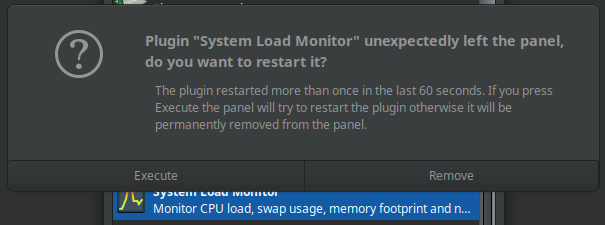

# xfce4-gpugraph-plugin

GPU Graph plugin for the Xfce4 panel. This plugin displays a real-time graph of AMD GPU usage over time, providing visual history of GPU utilization.

## Features

- **Real-time GPU Monitoring**: Live graph showing GPU usage history
- **Multi-GPU Support**: Monitor GPU0 and GPU1 simultaneously
- **ROCm Integration**: Uses `rocm-smi --showuse` for accurate AMD GPU readings
- **Configurable Colors**: Customize colors for each GPU
- **Tooltip Information**: Hover to see current usage percentages
- **Compact Display**: Space-efficient graph in the panel

## Installation

From source:

    % cd xfce4-gpugraph-plugin
    % meson setup build
    % meson compile -C build
    % meson install -C build

## Usage

1. Add the "GPU Graph" plugin to your Xfce panel
2. The plugin displays a scrolling graph of GPU usage over time
3. Hover over the graph for tooltip showing current usage
4. Right-click → Properties to configure colors and enable/disable GPUs

## Configuration

- **GPU0/GPU1 Enable**: Toggle monitoring for each GPU
- **Colors**: Customize the color for each GPU's graph line
- **Update Interval**: Adjust how often the graph updates (default: 1 second)
- **Graph Size**: Automatically adapts to panel size

## Requirements

- **AMD GPU** with ROCm drivers installed
- **rocm-smi** command available (typically at `/opt/rocm-*/bin/rocm-smi`)
- **Xfce4 panel**
- **GTK3**
- **libxfce4panel**
- **libxfce4ui**
- **libxfce4util**
- **xfconf**

## Screenshots

### GPU Graph Plugin in Action

*Real-time GPU utilization graph showing historical usage data for AMD GPUs.*

### Configuration Dialog

*Plugin configuration dialog allowing users to enable/disable individual GPUs and customize colors.*

### Panel Integration

*Compact GPU graph integrated into the XFCE panel with tooltip showing current usage.*

## License

GPL-2.0-or-later

## Development

This is a standalone GPU monitoring plugin. For integrated system monitoring (CPU + Memory + Network + GPU), see [xfce4-systemload-plugin-gpu](https://github.com/dmarsh400/xfce4-systemload-plugin-gpu).